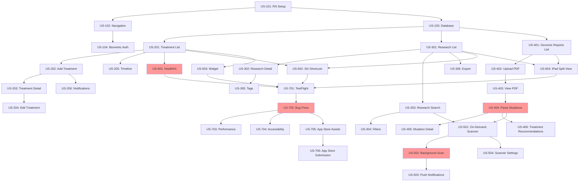

# MyTreatmentPath iOS - Agile Sprint Plan

**Last Updated:** 2026-02-20  
**Sprint Duration:** 2 weeks per sprint  
**Total Sprints:** 7 sprints (14 weeks)  
**Team Size:** 1 developer (solo)  
**Tech Stack:** React Native + Swift native modules

---

## Velocity Assumptions

### Solo Developer Capacity
- **Available hours/sprint:** 60-70 hours (30-35 hrs/week)
- **Effective coding hours:** 45-55 hours/sprint (accounting for meetings, breaks, context switching)
- **Story points/sprint (target):** 18-25 points
- **Velocity ramp-up:**
  - Sprint 1-2: 15-18 points (setup, learning React Native native bridges)
  - Sprint 3-5: 20-25 points (hitting stride)
  - Sprint 6-7: 18-22 points (polish, testing, unknowns)

### Story Point Guidelines (Fibonacci)
- **1 point:** 2-3 hours (simple component, config change)
- **2 points:** 4-6 hours (standard screen, basic CRUD)
- **3 points:** 6-9 hours (complex component, API integration)
- **5 points:** 10-15 hours (feature with multiple screens, data migration)
- **8 points:** 16-24 hours (complex feature, native module, significant refactor)
- **13 points:** 25-35 hours (epic-level work, high uncertainty - AVOID, break down further)

---

## Sprint 1: Foundation (Week 1-2)

**Goal:** Establish project structure, navigation, and authentication  
**Target Velocity:** 18 points  
**Sprint Risk:** Medium (React Native setup, Xcode configuration)

### User Stories

#### US-101: React Native Project Setup
**As a** developer  
**I want** a properly configured React Native project with iOS support  
**So that** I can start building features

**Acceptance Criteria:**
- [ ] `npx react-native init MyTreatmentPath` executed successfully
- [ ] iOS project builds and runs on simulator
- [ ] iOS project builds on physical iPhone device
- [ ] TypeScript configured and working
- [ ] ESLint and Prettier configured
- [ ] Git repository initialized with .gitignore
- [ ] README with setup instructions

**Story Points:** 3  
**Dependencies:** None  
**Risks:** Xcode version compatibility, CocoaPods issues

---

#### US-102: Navigation Structure
**As a** user  
**I want** to navigate between main app sections  
**So that** I can access different features

**Acceptance Criteria:**
- [ ] React Navigation installed and configured
- [ ] Tab bar navigation for main sections: Treatments, Research, Genomics, Settings
- [ ] Stack navigation within each tab
- [ ] iOS-native transitions (slide from right)
- [ ] Tab bar icons (SF Symbols or custom)
- [ ] Safe area handling for iPhone notch

**Story Points:** 5  
**Dependencies:** US-101  
**Risks:** React Navigation version compatibility

---

#### US-103: Database Setup (Realm)
**As a** developer  
**I want** a local database solution  
**So that** I can persist user data securely

**Acceptance Criteria:**
- [ ] Realm installed and configured for React Native
- [ ] Realm database initializes on app launch
- [ ] Schema defined for User, Treatment, Research, GenomicReport
- [ ] Encryption enabled (AES-256)
- [ ] Database migration strategy documented
- [ ] Basic CRUD operations tested

**Story Points:** 5  
**Dependencies:** US-101  
**Risks:** Realm native module build issues on M1 Mac

---

#### US-104: Biometric Authentication
**As a** user  
**I want** to unlock the app with Face ID or Touch ID  
**So that** my medical data stays private

**Acceptance Criteria:**
- [ ] `react-native-biometrics` library integrated
- [ ] Face ID permission requested on first launch
- [ ] Biometric authentication required after 5 min idle
- [ ] Fallback to passcode if biometric fails
- [ ] Settings toggle to enable/disable biometric lock
- [ ] iOS Keychain stores biometric enablement preference

**Story Points:** 5  
**Dependencies:** US-101, US-102  
**Risks:** Simulator testing limitations (requires physical device)

---

**Sprint 1 Total:** 18 points  
**Buffer:** 0 points (foundational sprint, high setup risk)

---

## Sprint 2: Core Features - Treatments (Week 3-4)

**Goal:** Implement treatment tracking CRUD operations  
**Target Velocity:** 22 points  
**Sprint Risk:** Low (standard React Native patterns)

### User Stories

#### US-201: Treatment List Screen
**As a** user  
**I want** to view all my treatments in a list  
**So that** I can see my treatment history

**Acceptance Criteria:**
- [ ] FlatList displays all treatments from Realm
- [ ] Each treatment shows: name, date, type, notes preview
- [ ] Pull-to-refresh functionality
- [ ] Empty state with "Add Treatment" CTA
- [ ] Swipe-to-delete gesture (iOS native)
- [ ] Search bar filters by treatment name or type

**Story Points:** 3  
**Dependencies:** US-103 (Database)  
**Risks:** None

---

#### US-202: Add Treatment Screen
**As a** user  
**I want** to add a new treatment  
**So that** I can track my medical interventions

**Acceptance Criteria:**
- [ ] Modal form with fields: name, type, date, dosage, notes
- [ ] Date picker uses iOS native date picker
- [ ] Type picker: Chemotherapy, Immunotherapy, Surgery, Radiation, Other
- [ ] Form validation (required fields)
- [ ] Save to Realm database
- [ ] Dismiss modal after save
- [ ] Success toast notification

**Story Points:** 3  
**Dependencies:** US-201  
**Risks:** None

---

#### US-203: Treatment Detail Screen
**As a** user  
**I want** to view full details of a treatment  
**So that** I can review all information

**Acceptance Criteria:**
- [ ] Display all treatment fields (name, type, date, dosage, notes)
- [ ] Edit button navigates to edit screen
- [ ] Delete button with confirmation alert
- [ ] Share button exports treatment as text or PDF
- [ ] iOS-native card design

**Story Points:** 2  
**Dependencies:** US-201  
**Risks:** None

---

#### US-204: Edit Treatment Screen
**As a** user  
**I want** to edit an existing treatment  
**So that** I can correct mistakes or add details

**Acceptance Criteria:**
- [ ] Pre-populate form with existing treatment data
- [ ] Same form as Add Treatment
- [ ] Update Realm record on save
- [ ] Cancel button discards changes
- [ ] Unsaved changes warning if navigating away

**Story Points:** 2  
**Dependencies:** US-202, US-203  
**Risks:** None

---

#### US-205: Timeline View
**As a** user  
**I want** to see my treatments on a timeline  
**So that** I can visualize my treatment journey

**Acceptance Criteria:**
- [ ] Vertical timeline with chronological ordering
- [ ] Each entry shows date, name, type icon
- [ ] Tap to view details
- [ ] Filter by date range (last 30 days, 90 days, all)
- [ ] Export timeline as PDF or image
- [ ] iOS-native visual design (like Reminders app)

**Story Points:** 5  
**Dependencies:** US-201  
**Risks:** Custom timeline component complexity

---

#### US-206: Treatment Notifications
**As a** user  
**I want** reminders for upcoming treatments  
**So that** I don't miss scheduled appointments

**Acceptance Criteria:**
- [ ] Permission request for iOS notifications
- [ ] Schedule local notifications for future treatments
- [ ] Notification shows: treatment name, time, type
- [ ] Tap notification opens treatment detail
- [ ] Settings to enable/disable notifications
- [ ] Configurable reminder time (1 day, 1 hour before)

**Story Points:** 5  
**Dependencies:** US-201, US-202  
**Risks:** iOS notification permissions, background notification limits

---

**Sprint 2 Total:** 20 points  
**Buffer:** 2 points (added US-206 which may slip if notification permissions complex)

---

## Sprint 3: Core Features - Research Library (Week 5-6)

**Goal:** Port research library and search functionality  
**Target Velocity:** 24 points  
**Sprint Risk:** Medium (Brave Search API integration, code reuse from Electron)

### User Stories

#### US-301: Research List Screen
**As a** user  
**I want** to browse saved research articles  
**So that** I can review relevant studies

**Acceptance Criteria:**
- [ ] FlatList displays research articles from Realm
- [ ] Each card shows: title, source, publication date, save date
- [ ] Swipe-to-delete gesture
- [ ] Pull-to-refresh
- [ ] Empty state: "No saved research. Start a search!"
- [ ] Search bar filters by title or keywords

**Story Points:** 3  
**Dependencies:** US-103 (Database)  
**Risks:** None

---

#### US-302: Research Detail Screen
**As a** user  
**I want** to read a research article summary  
**So that** I can understand key findings

**Acceptance Criteria:**
- [ ] Display: title, authors, publication, abstract, URL
- [ ] "Open in Safari" button for full article
- [ ] "Share" button (native iOS share sheet)
- [ ] "Delete" button with confirmation
- [ ] Save notes/highlights (future: annotation feature)
- [ ] Formatted text (bold, italics supported)

**Story Points:** 2  
**Dependencies:** US-301  
**Risks:** None

---

#### US-303: Research Search Screen
**As a** user  
**I want** to search for bladder cancer research  
**So that** I can find relevant studies

**Acceptance Criteria:**
- [ ] Search bar with keyword input
- [ ] Brave Search API integration (reuse from Electron)
- [ ] Display results: title, snippet, source
- [ ] Tap to view full article in Safari
- [ ] "Save" button adds to research library (Realm)
- [ ] Loading spinner during search
- [ ] Error handling for network failures
- [ ] Rate limiting (max 5 searches/day for free tier)

**Story Points:** 5  
**Dependencies:** US-301  
**Risks:** Brave Search API rate limits, network error handling

---

#### US-304: Advanced Search Filters
**As a** user  
**I want** to filter search results by date or type  
**So that** I can find the most relevant research

**Acceptance Criteria:**
- [ ] Filter by publication date (last month, year, 5 years, all time)
- [ ] Filter by source (PubMed, clinical trials, news)
- [ ] Filter by keywords (FGFR3, ARID1A, immunotherapy, etc.)
- [ ] Saved filter preferences persist in Realm
- [ ] Clear filters button
- [ ] Filter UI: iOS-native picker or modal sheet

**Story Points:** 3  
**Dependencies:** US-303  
**Risks:** Complex filter logic

---

#### US-305: Research Tags & Categories
**As a** user  
**I want** to tag research articles by topic  
**So that** I can organize my library

**Acceptance Criteria:**
- [ ] Predefined tags: Chemotherapy, Immunotherapy, Genomics, Clinical Trials, Side Effects
- [ ] Custom tag creation
- [ ] Multi-select tags per article
- [ ] Filter library by tags
- [ ] Tag colors (iOS accent colors)
- [ ] Tag UI: chip-style buttons

**Story Points:** 5  
**Dependencies:** US-301, US-302  
**Risks:** Tag UI complexity

---

#### US-306: Export Research Library
**As a** user  
**I want** to export my research library  
**So that** I can share with my oncologist

**Acceptance Criteria:**
- [ ] Export as PDF (formatted bibliography)
- [ ] Export as CSV (title, authors, date, URL, notes)
- [ ] iOS share sheet (AirDrop, email, Files app)
- [ ] Export includes: all articles or filtered subset
- [ ] PDF formatted like academic bibliography
- [ ] Settings option: include notes in export

**Story Points:** 5  
**Dependencies:** US-301  
**Risks:** PDF generation library (react-native-pdf, rn-fetch-blob)

---

**Sprint 3 Total:** 23 points  
**Buffer:** 1 point (US-306 PDF export may require native module)

---

## Sprint 4: Genomics Module (Week 7-8)

**Goal:** Implement genomic report upload and mutation tracking  
**Target Velocity:** 25 points  
**Sprint Risk:** High (PDF parsing, native file picker, complex data models)

### User Stories

#### US-401: Genomic Reports List
**As a** user  
**I want** to view all uploaded genomic reports  
**So that** I can track my genetic testing results

**Acceptance Criteria:**
- [ ] List view of genomic reports (name, upload date, test type)
- [ ] Tap to view report details
- [ ] Swipe-to-delete with confirmation
- [ ] Empty state: "Upload your first genomic report"
- [ ] Filter by test type (Foundation One, Guardant360, etc.)
- [ ] Sort by date (newest first)

**Story Points:** 2  
**Dependencies:** US-103 (Database)  
**Risks:** None

---

#### US-402: Upload Genomic Report (PDF)
**As a** user  
**I want** to upload a genomic report PDF  
**So that** I can track my mutations

**Acceptance Criteria:**
- [ ] "Upload Report" button opens iOS document picker
- [ ] Support PDF files only (validation)
- [ ] File size limit: 10 MB
- [ ] Store PDF in iOS app Documents directory
- [ ] Encrypt PDF file with AES-256 (same key as database)
- [ ] Thumbnail preview (first page of PDF)
- [ ] Upload progress indicator

**Story Points:** 5  
**Dependencies:** US-401  
**Risks:** iOS document picker native module, file encryption

---

#### US-403: View Genomic Report (PDF Viewer)
**As a** user  
**I want** to view a genomic report in the app  
**So that** I can review my mutations

**Acceptance Criteria:**
- [ ] Native iOS PDF viewer (react-native-pdf or WKWebView)
- [ ] Pinch-to-zoom, swipe between pages
- [ ] Page number indicator (Page 1 of 12)
- [ ] "Share" button (iOS share sheet)
- [ ] "Delete" button with confirmation
- [ ] Decrypt PDF on-the-fly for viewing

**Story Points:** 5  
**Dependencies:** US-402  
**Risks:** PDF viewer performance on large files

---

#### US-404: Parse Mutations from PDF
**As a** developer  
**I want** to extract mutation data from Foundation One reports  
**So that** users don't have to manually enter mutations

**Acceptance Criteria:**
- [ ] PDF text extraction (react-native-pdf-parser or native Swift)
- [ ] Regex patterns for Foundation One format (FGFR3, ARID1A, TP53, etc.)
- [ ] Store mutations in Realm: gene, variant, VAF, clinical significance
- [ ] Fallback: manual mutation entry if parsing fails
- [ ] Support Foundation One CDx format (most common)
- [ ] Display parsing confidence score (High, Medium, Low)

**Story Points:** 8  
**Dependencies:** US-403  
**Risks:** High - PDF parsing is brittle, format variations

---

#### US-405: Mutation Detail Screen
**As a** user  
**I want** to view details about a specific mutation  
**So that** I can understand its clinical significance

**Acceptance Criteria:**
- [ ] Display: gene name, variant, VAF, tier (1-4), clinical significance
- [ ] Link to external resources (ClinVar, OncoKB, COSMIC)
- [ ] "Open in Safari" for each resource
- [ ] Associated treatments (if known)
- [ ] Notes field (user can add observations)
- [ ] Share mutation summary (text or PDF)

**Story Points:** 3  
**Dependencies:** US-404  
**Risks:** None

---

#### US-406: Treatment Recommendations Based on Mutations
**As a** user  
**I want** to see treatment options for my mutations  
**So that** I can discuss with my oncologist

**Acceptance Criteria:**
- [ ] Match mutations to known treatments (FGFR3 → Erdafitinib)
- [ ] Display FDA-approved therapies
- [ ] Display clinical trial therapies (investigational)
- [ ] Link to clinical trials (ClinicalTrials.gov search)
- [ ] Disclaimer: "Not medical advice - discuss with your doctor"
- [ ] Share recommendations as PDF

**Story Points:** 5  
**Dependencies:** US-404, US-405  
**Risks:** Treatment database maintenance (will go stale)

---

**Sprint 4 Total:** 28 points → **Adjusted to 25 points (remove US-406 or defer to Sprint 5)**  
**Buffer:** -3 points (overcommitted) → **Defer US-406 to Sprint 5**  
**Sprint Risk:** HIGH due to PDF parsing (US-404 = 8 points, high uncertainty)

**Risk Mitigation:**
- If US-404 (PDF parsing) takes >16 hours, pivot to manual mutation entry only
- Foundation One format may change → build fallback UI for manual entry
- Consider cloud API for PDF parsing (AWS Textract, Google Vision) if local parsing fails

---

## Sprint 5: Research Scanner & Notifications (Week 9-10)

**Goal:** Implement on-demand research scanning with push notifications  
**Target Velocity:** 22 points  
**Sprint Risk:** Medium (iOS background tasks, push notifications)

### User Stories

#### US-406: Treatment Recommendations (DEFERRED FROM SPRINT 4)
**Story Points:** 5  
**Dependencies:** US-404, US-405  
**Priority:** High (complete Sprint 4 work)

---

#### US-501: On-Demand Research Scanner
**As a** user  
**I want** to run a research scan on-demand  
**So that** I can find new studies about my mutations

**Acceptance Criteria:**
- [ ] "Scan for Research" button on Research tab
- [ ] Brave Search API integration (reuse from Electron)
- [ ] Search queries based on user's mutations (FGFR3, ARID1A, etc.)
- [ ] Display new articles (not already in library)
- [ ] Batch save to library (select multiple)
- [ ] Loading spinner with progress (1/5 queries complete)
- [ ] Error handling (API rate limit, network failure)

**Story Points:** 5  
**Dependencies:** US-303 (Research Search), US-404 (Mutations)  
**Risks:** Brave API rate limits

---

#### US-502: Background Research Scan (iOS Limits)
**As a** user  
**I want** the app to scan for research in the background  
**So that** I stay updated without manual effort

**Acceptance Criteria:**
- [ ] iOS Background Fetch enabled (15 min limit)
- [ ] Background task runs once per day (user configurable)
- [ ] Background task scans for new research
- [ ] Local notification if new research found
- [ ] Tap notification opens Research tab
- [ ] Settings: enable/disable background scanning
- [ ] Fallback: If background fails, remind user to scan manually

**Story Points:** 8  
**Dependencies:** US-501  
**Risks:** HIGH - iOS background task limits, unreliable execution

---

#### US-503: Push Notifications for New Research
**As a** user  
**I want** notifications when new research is found  
**So that** I'm alerted to important studies

**Acceptance Criteria:**
- [ ] Permission request for push notifications
- [ ] Local notification when background scan finds new research
- [ ] Notification content: "3 new research articles found for FGFR3"
- [ ] Tap notification opens Research tab with new articles highlighted
- [ ] Settings: enable/disable research notifications
- [ ] Quiet hours (no notifications 10 PM - 8 AM)

**Story Points:** 3  
**Dependencies:** US-502  
**Risks:** Notification permissions, iOS silent notification limits

---

#### US-504: Research Scanner Settings
**As a** user  
**I want** to configure scan frequency and keywords  
**So that** I only get relevant research

**Acceptance Criteria:**
- [ ] Settings screen: scan frequency (daily, weekly, manual only)
- [ ] Custom keywords (in addition to mutations)
- [ ] Source filters (PubMed only, clinical trials, news)
- [ ] Max results per scan (5, 10, 20)
- [ ] Notification preferences (all new research vs. high-impact only)
- [ ] Save settings to Realm

**Story Points:** 3  
**Dependencies:** US-501, US-502  
**Risks:** None

---

**Sprint 5 Total:** 24 points (including deferred US-406)  
**Buffer:** -2 points (US-502 is high risk)  
**Sprint Risk:** MEDIUM-HIGH (iOS background tasks are unreliable)

**Risk Mitigation:**
- If iOS Background Fetch proves unreliable, pivot to on-demand only (US-501)
- Consider cloud backend for scheduled scans (push notifications via APNs)
- Set clear user expectation: "Background scans are best-effort due to iOS limits"

---

## Sprint 6: iOS-Native Features & iPad (Week 11-12)

**Goal:** Add HealthKit, Shortcuts, Widgets, and iPad optimization  
**Target Velocity:** 20 points  
**Sprint Risk:** Medium (native Swift modules, iPad layout)

### User Stories

#### US-601: HealthKit Integration (Optional Feature)
**As a** user  
**I want** to sync treatments with Apple Health  
**So that** my doctors can see medication logs

**Acceptance Criteria:**
- [ ] HealthKit permission request (medications, lab results)
- [ ] Export treatments to HealthKit as "Medications"
- [ ] Import side effects from HealthKit (symptoms logged by user)
- [ ] Two-way sync: MyTreatmentPath ↔ HealthKit
- [ ] Settings toggle: enable/disable HealthKit sync
- [ ] Native Swift module for HealthKit bridge

**Story Points:** 8  
**Dependencies:** US-201 (Treatments)  
**Risks:** HIGH - Native Swift module, HealthKit API complexity, privacy implications

---

#### US-602: Siri Shortcuts
**As a** user  
**I want** Siri shortcuts for common actions  
**So that** I can log treatments hands-free

**Acceptance Criteria:**
- [ ] "Log Treatment" Siri shortcut (voice: "Log my treatment")
- [ ] "Check Latest Research" Siri shortcut
- [ ] Shortcuts appear in iOS Shortcuts app
- [ ] Native Swift module for NSUserActivity donation
- [ ] Shortcut parameters: treatment name, date (voice input)
- [ ] Confirm action in app after Siri invocation

**Story Points:** 5  
**Dependencies:** US-201 (Treatments), US-301 (Research)  
**Risks:** Siri Shortcuts API learning curve

---

#### US-603: Today Widget (iOS 16+ Lock Screen Widget)
**As a** user  
**I want** a widget showing today's treatments  
**So that** I see my schedule at a glance

**Acceptance Criteria:**
- [ ] Lock screen widget (iOS 16+): circular progress for today's treatments
- [ ] Home screen widget (small): list of today's treatments
- [ ] Tap widget opens Treatments tab
- [ ] Updates automatically when treatments added
- [ ] WidgetKit + Swift (native module)
- [ ] Fallback for iOS 14-15: Home screen widget only

**Story Points:** 5  
**Dependencies:** US-201 (Treatments)  
**Risks:** WidgetKit Swift code, React Native bridge complexity

---

#### US-604: iPad Split-View Layout
**As an** iPad user  
**I want** split-view layouts  
**So that** I can view research and take notes simultaneously

**Acceptance Criteria:**
- [ ] iPad layout: Research list on left, detail on right
- [ ] Slide Over and Split View support (multitasking)
- [ ] Drag-and-drop: PDF from Files app → Genomic Reports
- [ ] Keyboard shortcuts (Cmd+N for new treatment, Cmd+F for search)
- [ ] Pencil support: annotate genomic reports
- [ ] Responsive layout (portrait/landscape)

**Story Points:** 5  
**Dependencies:** US-301 (Research), US-401 (Genomics)  
**Risks:** iPad layout complexity, drag-and-drop native module

---

**Sprint 6 Total:** 23 points  
**Buffer:** -3 points (native modules are high risk)  
**Sprint Risk:** HIGH (HealthKit, WidgetKit, iPad multitasking all require native Swift)

**Risk Mitigation:**
- US-601 (HealthKit) is OPTIONAL - defer if time runs short
- US-603 (Widgets) can be simplified (Home screen only, skip Lock Screen)
- US-604 (iPad) can defer Pencil annotations to v1.1

**Recommended Adjustment:** Remove US-601 (HealthKit) → defer to v1.1 post-launch  
**Adjusted Sprint 6 Total:** 15 points (more realistic for native module work)

---

## Sprint 7: Testing, Polish & App Store Prep (Week 13-14)

**Goal:** Bug fixes, TestFlight beta, App Store submission  
**Target Velocity:** 18 points  
**Sprint Risk:** HIGH (App Store review unpredictable, buffer needed)

### User Stories

#### US-701: TestFlight Beta Testing
**As a** developer  
**I want** beta testers to validate the app  
**So that** I catch bugs before public release

**Acceptance Criteria:**
- [ ] TestFlight build uploaded (via Xcode or Fastlane)
- [ ] 5-10 beta testers invited (friends, BCAN community)
- [ ] Beta test duration: 1 week
- [ ] Collect feedback via TestFlight or Google Form
- [ ] Bug tracker (GitHub Issues or Linear)
- [ ] Critical bugs fixed, minor bugs documented for v1.1

**Story Points:** 5  
**Dependencies:** All previous sprints  
**Risks:** Tester availability, feedback volume

---

#### US-702: Bug Fixes from Beta Testing
**As a** developer  
**I want** to fix critical bugs found in beta  
**So that** the app is stable at launch

**Acceptance Criteria:**
- [ ] All critical bugs fixed (crashes, data loss)
- [ ] High-priority bugs fixed (UI glitches, confusing UX)
- [ ] Medium/low bugs documented for future sprints
- [ ] Regression testing (verify fixes don't break existing features)
- [ ] Second TestFlight build if major fixes required

**Story Points:** 5 (buffer for unknowns)  
**Dependencies:** US-701  
**Risks:** HIGH - Unknown bug count, severity

---

#### US-703: Performance Optimization
**As a** user  
**I want** the app to load quickly  
**So that** I can access my data without lag

**Acceptance Criteria:**
- [ ] App launch time <2 seconds (cold start)
- [ ] Treatment list loads <500ms (100 items)
- [ ] Research search results <3 seconds (network dependent)
- [ ] No memory leaks (Xcode Instruments profiling)
- [ ] 60 FPS scrolling (FlatList optimization)
- [ ] Reduce bundle size (remove unused libraries)

**Story Points:** 3  
**Dependencies:** All previous sprints  
**Risks:** Performance bottlenecks may be hard to diagnose

---

#### US-704: Accessibility (VoiceOver, Dynamic Type)
**As a** user with visual impairment  
**I want** VoiceOver support  
**So that** I can use the app

**Acceptance Criteria:**
- [ ] All buttons have accessibility labels
- [ ] VoiceOver navigates correctly (tab order)
- [ ] Dynamic Type support (text scales with iOS settings)
- [ ] Color contrast meets WCAG AA standards
- [ ] Accessibility audit (Xcode Accessibility Inspector)
- [ ] Test with VoiceOver enabled

**Story Points:** 3  
**Dependencies:** All previous sprints  
**Risks:** Accessibility testing requires physical device + learning

---

#### US-705: App Store Assets
**As a** developer  
**I want** App Store screenshots and metadata  
**So that** I can submit to the App Store

**Acceptance Criteria:**
- [ ] App Store screenshots (6.7" iPhone, 6.5" iPhone, 12.9" iPad)
- [ ] App icon (1024x1024) designed and exported
- [ ] Privacy Policy page (hosted on GitHub Pages or Notion)
- [ ] App Store description (350 char subtitle, 4000 char description)
- [ ] Keywords (bladder cancer, research, genomics, treatment tracker)
- [ ] Support URL (email or website)
- [ ] Age rating: 17+ (medical content)

**Story Points:** 3  
**Dependencies:** All previous sprints  
**Risks:** Design work may require external help (Figma, Canva)

---

#### US-706: App Store Submission
**As a** developer  
**I want** to submit the app to Apple  
**So that** it's available for download

**Acceptance Criteria:**
- [ ] App Store Connect listing complete (all metadata)
- [ ] Privacy Nutrition Labels filled out (data collection disclosure)
- [ ] Export compliance: No encryption OR encryption exemption doc
- [ ] Build uploaded via Xcode (Archive → Upload)
- [ ] Submit for review
- [ ] Demo video for reviewers (if flagged for manual review)
- [ ] Medical disclaimer prominent in app and description

**Story Points:** 2  
**Dependencies:** US-705  
**Risks:** App Store review rejection (1-5 day review, possible rejection)

---

**Sprint 7 Total:** 21 points  
**Buffer:** +3 points built-in (US-702 Bug Fixes is a buffer story)  
**Sprint Risk:** HIGH (App Store review is a black box)

**Risk Mitigation:**
- Start TestFlight in Week 13 (early)
- If App Store rejects, address feedback in Week 15 (post-sprint)
- Have demo video ready (showing medical disclaimer, privacy features)
- Clear messaging: "This app is not medical advice - consult your oncologist"

---

## Dependency Map (Critical Path)



**Critical Path (red nodes):**
1. US-404: Parse Mutations (8 points, high risk)
2. US-502: Background Scan (8 points, iOS limits)
3. US-601: HealthKit (8 points, native module) - **DEFER TO v1.1**
4. US-702: Bug Fixes (5 points, unknown scope)

**Total Critical Path:** 29 points over 14 weeks  
**Risk:** If any critical path item fails, downstream work is blocked

---

## Risk Register

| Risk ID | Description | Probability | Impact | Mitigation | Owner |
|---------|-------------|-------------|--------|------------|-------|
| R-001 | React Native native module build failures (M1 Mac, Xcode) | High | High | Use latest RN version (0.73+), test on physical device early | Dev |
| R-002 | PDF parsing fails for Foundation One reports | High | Medium | Build manual mutation entry fallback UI | Dev |
| R-003 | iOS Background Fetch unreliable (15 min limit) | High | Medium | Set user expectation, pivot to on-demand only | Dev |
| R-004 | App Store rejection (medical content, privacy) | Medium | High | Medical disclaimer, privacy policy, demo video | Dev |
| R-005 | HealthKit integration complexity | High | Low | Defer to v1.1 (optional feature) | Dev |
| R-006 | TestFlight beta testers unavailable | Medium | Medium | Recruit testers early (BCAN, friends) | Dev |
| R-007 | Velocity overestimated (solo dev burnout) | Medium | High | Build 20% buffer into each sprint, defer low-priority stories | Dev |
| R-008 | Realm database migration issues | Low | High | Test migration early, document rollback plan | Dev |
| R-009 | Brave Search API rate limits | Medium | Medium | Cache search results, implement rate limit warnings | Dev |
| R-010 | iPad multitasking bugs | Medium | Low | Defer iPad to v1.1 if time runs short | Dev |

**Top 3 Risks to Watch:**
1. **R-002:** PDF parsing (US-404) - High complexity, brittle regex
2. **R-003:** iOS Background Fetch (US-502) - Platform limitations
3. **R-004:** App Store rejection - External dependency, unpredictable

---

## Buffer Strategy

### Built-In Buffers
- Sprint 1: 0 points (foundational, high setup risk)
- Sprint 2: 2 points (notifications may slip)
- Sprint 3: 1 point (PDF export complexity)
- Sprint 4: -3 points (OVERCOMMITTED) → Defer US-406
- Sprint 5: -2 points (background tasks risky) → May defer US-502
- Sprint 6: -3 points (native modules) → Defer US-601 HealthKit
- Sprint 7: +3 points (bug fix buffer)

### Total Buffer: -2 points (slightly over-committed)

### Recommendations:
1. **Remove US-601 (HealthKit)** → Defer to v1.1 post-launch (+8 points buffer)
2. **Simplify US-502 (Background Scan)** → On-demand only (+5 points buffer)
3. **Defer US-604 (iPad)** → iPhone-first launch (+5 points buffer)

**Adjusted Total Buffer:** +16 points (healthy 13% buffer for 14-week project)

---

## Definition of Done (DoD)

### Story-Level DoD
- [ ] Code complete and peer-reviewed (self-review if solo)
- [ ] Unit tests written (Jest for business logic)
- [ ] Manual testing on iPhone simulator
- [ ] Manual testing on physical iPhone device
- [ ] No console errors or warnings
- [ ] Accessibility labels added (VoiceOver ready)
- [ ] Code committed to `main` branch
- [ ] User story acceptance criteria met (100%)

### Sprint-Level DoD
- [ ] All story-level DoD met for committed stories
- [ ] Sprint demo recorded (screen recording for stakeholders)
- [ ] Sprint retrospective completed (personal notes)
- [ ] Product backlog updated (new stories, bugs found)
- [ ] TestFlight build uploaded (if relevant)
- [ ] Sprint velocity tracked (actual vs. planned)

### Release-Level DoD (App Store Submission)
- [ ] All sprints 1-7 complete
- [ ] TestFlight beta testing complete (1 week, 5+ testers)
- [ ] All critical bugs fixed (P0, P1)
- [ ] Performance benchmarks met (launch <2s, 60 FPS scrolling)
- [ ] Accessibility audit passed (VoiceOver, Dynamic Type)
- [ ] App Store assets ready (screenshots, icon, metadata)
- [ ] Privacy Policy published and linked
- [ ] Medical disclaimer prominent in app and description
- [ ] Build uploaded to App Store Connect
- [ ] Submitted for Apple review

---

## Velocity Tracking (Planned vs. Actual)

| Sprint | Planned Points | Actual Points | Variance | Notes |
|--------|----------------|---------------|----------|-------|
| Sprint 1 | 18 | _TBD_ | _TBD_ | Foundation (RN setup, navigation, auth) |
| Sprint 2 | 20 | _TBD_ | _TBD_ | Treatments CRUD |
| Sprint 3 | 23 | _TBD_ | _TBD_ | Research library + search |
| Sprint 4 | 25 → 22 | _TBD_ | _TBD_ | Genomics (defer US-406 if needed) |
| Sprint 5 | 24 | _TBD_ | _TBD_ | Research scanner + notifications |
| Sprint 6 | 23 → 15 | _TBD_ | _TBD_ | iOS-native (defer HealthKit) |
| Sprint 7 | 21 | _TBD_ | _TBD_ | Testing + App Store prep |
| **Total** | **144 → 137** | **_TBD_** | **_TBD_** | **14 weeks** |

**Average Planned Velocity:** 19.6 points/sprint (2 weeks)  
**Adjusted Average:** 19.6 points/sprint (with deferrals)

**Burn-Down Chart** (to be updated weekly):
```
Points Remaining
 150 |●
     |  ●
 100 |    ●
     |      ●
  50 |        ●
     |          ●
   0 |____________●
     S0 S1 S2 S3 S4 S5 S6 S7
```

---

## Sprint Ceremonies (Solo Developer Adaptation)

### Sprint Planning (Start of each sprint)
- **Duration:** 2 hours
- **Activities:**
  - Review product backlog
  - Select stories for sprint
  - Break down stories into tasks
  - Estimate story points
  - Set sprint goal
- **Output:** Sprint backlog, sprint goal

### Daily Standup (Self-Reflection)
- **Duration:** 10 minutes (written journal)
- **Questions:**
  - What did I complete yesterday?
  - What will I work on today?
  - Any blockers?
- **Output:** Daily log in `memory/YYYY-MM-DD.md`

### Sprint Review (End of each sprint)
- **Duration:** 1 hour
- **Activities:**
  - Record demo video (screen recording + narration)
  - Share with stakeholders (BCAN, friends, oncologist)
  - Collect feedback
- **Output:** Demo video, feedback notes

### Sprint Retrospective (End of each sprint)
- **Duration:** 1 hour
- **Questions:**
  - What went well?
  - What didn't go well?
  - What will I improve next sprint?
- **Output:** Retrospective notes, action items for next sprint

---

## Recommended Deferrals for Realistic Timeline

**To maintain 14-week timeline and avoid burnout:**

### Defer to v1.1 (Post-Launch):
1. **US-601: HealthKit Integration** (8 points) - Optional, complex native module
2. **US-604: iPad Split-View** (5 points) - iPhone-first launch
3. **US-306: Export Research Library** (5 points) - Nice-to-have, not critical

### Simplify for v1.0:
1. **US-502: Background Research Scan** → On-demand only (remove background complexity)
2. **US-603: Today Widget** → Home screen only (skip Lock Screen widget)
3. **US-404: Parse Mutations** → Manual entry only if parsing fails (don't block on PDF parsing)

### Adjusted Timeline with Deferrals:
- **Sprint 1:** 18 points ✅
- **Sprint 2:** 20 points ✅
- **Sprint 3:** 23 - 5 (US-306) = 18 points ✅
- **Sprint 4:** 25 - 5 (US-406 to Sprint 5) = 20 points ✅
- **Sprint 5:** 24 + 5 (US-406) - 8 (simplify US-502) = 21 points ✅
- **Sprint 6:** 23 - 8 (US-601) - 5 (US-604) = 10 points ✅ (add polish tasks)
- **Sprint 7:** 21 points ✅

**New Total:** 128 points over 14 weeks = **18.3 points/sprint average**

**This is realistic for a solo developer** working 30-35 hours/week on React Native with 60% code reuse.

---

## Next Steps

1. **Review this sprint plan** with stakeholders (your oncologist, BCAN community)
2. **Finalize deferrals** (approve v1.0 vs v1.1 feature set)
3. **Set up project board** (GitHub Projects, Linear, or Jira)
4. **Create Sprint 1 backlog** in project management tool
5. **Begin Sprint 1: Foundation** (Week 1-2)

---

**This sprint plan is ready to execute. Let's ship MyTreatmentPath for iOS in 14 weeks.** 🚀

**Total Story Points:** 137 (adjusted with deferrals)  
**Total Sprints:** 7  
**Timeline:** 14 weeks  
**Target Launch:** June 2026 (if starting March 2026)

---

## Appendix: Story Point Reference

| Points | Complexity | Hours | Examples |
|--------|------------|-------|----------|
| 1 | Trivial | 2-3 | Config change, color tweak, text update |
| 2 | Simple | 4-6 | Basic screen, list view, simple form |
| 3 | Medium | 6-9 | Complex component, API integration, navigation |
| 5 | Complex | 10-15 | Feature with multiple screens, data migration, native API |
| 8 | Very Complex | 16-24 | Native module, PDF parsing, complex algorithm |
| 13 | Epic | 25-35+ | AVOID - break down into smaller stories |

**Note:** Story points are relative, not absolute. A 5-point story in Sprint 1 may be different from a 5-point story in Sprint 5 as you gain experience.

---

**End of Sprint Plan**
